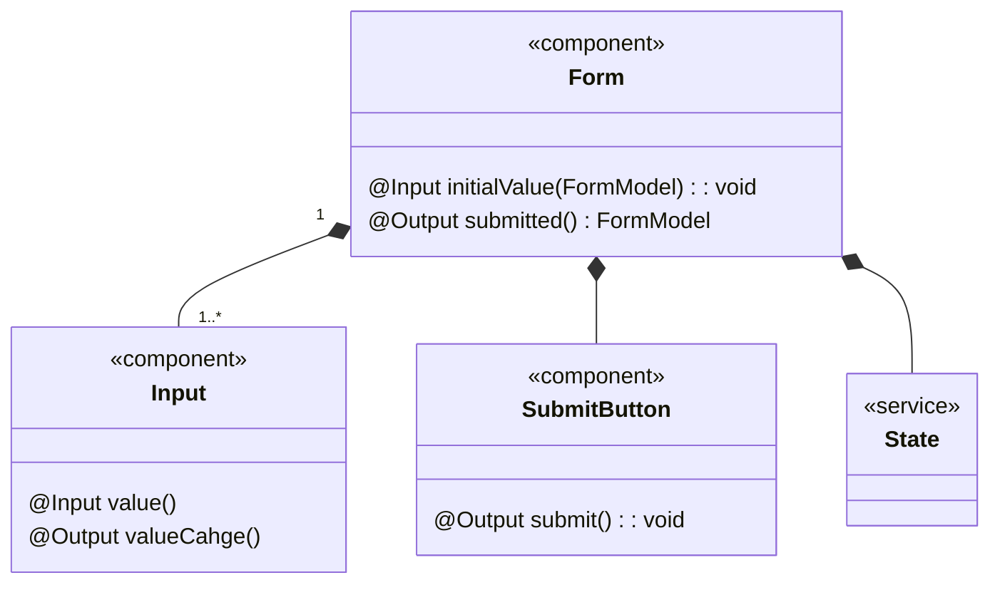
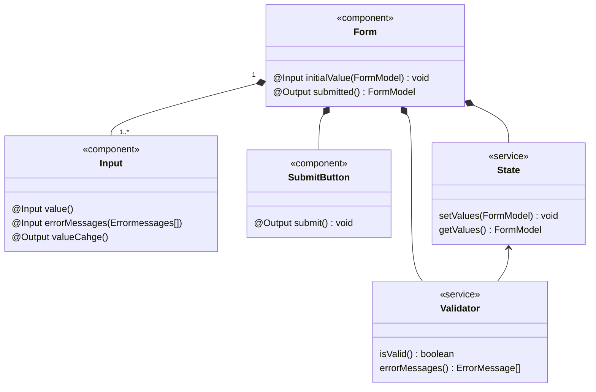

# Angular signal apiによるリアルタイムバリデーションの実装
## リアルタイムバリデーションなしのフォーム

```mermaid
classDiagram
  Form "1" *-- "1..*" Input
  Form *-- SubmitButton
  Form *-- State

  class Form {
    <<component>>
    @Input initialValue(FormModel): void
    @Output submitted() FormModel
  }
  class SubmitButton {
    <<component>>
    @Output submit(): void
  }
  class Input {
    <<component>>
    @Input value()
    @Output valueCahge()
  }
  class State {
    <<service>>
  }
```

## リアルタイムバリデーションありのフォーム

```mermaid
classDiagram
  Form "1" *-- "1..*" Input
  Form *-- SubmitButton
  Form *-- State
  Form *-- Validator
  State <-- Validator

  class Form {
    <<component>>
    @Input initialValue(FormModel) void
    @Output submitted() FormModel
  }
  class SubmitButton {
    <<component>>
    @Output submit() void
  }
  class Input {
    <<component>>
    @Input value()
    @Input errorMessages(Errormessages[])
    @Output valueCahge()
  }
  class State {
    <<service>>
    setValues(FormModel) void
    getValues() FormModel
  }

  class Validator {
    <<service>>
    isValid() boolean
    errorMessages() ErrorMessage[]
  }
```
